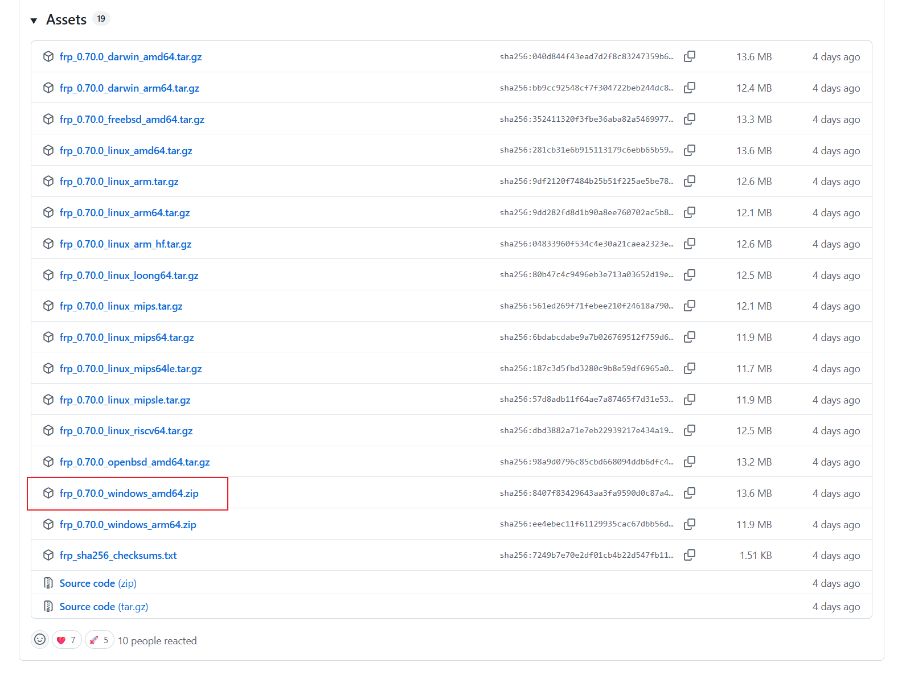
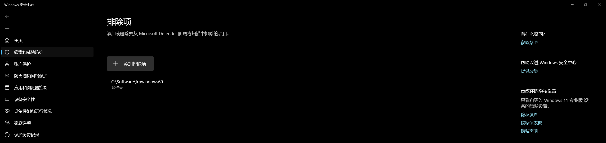
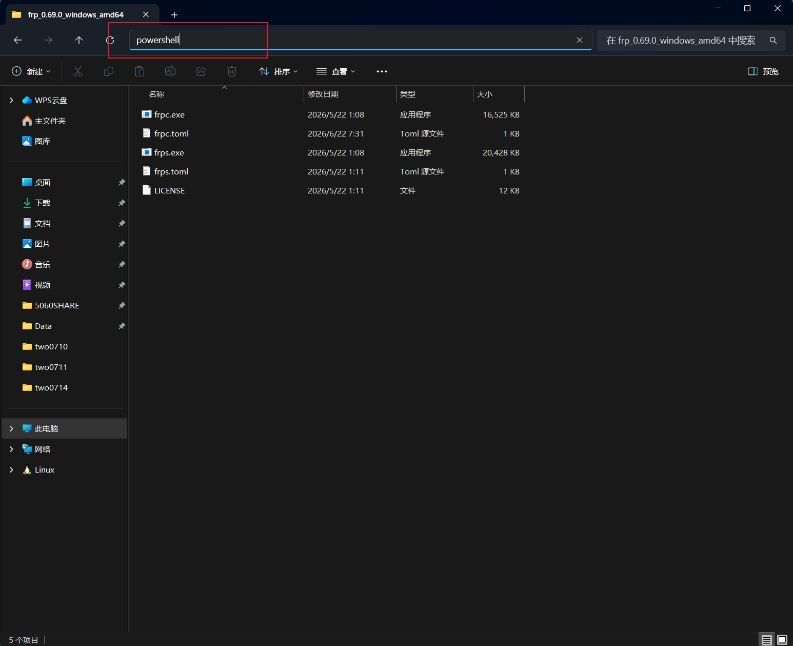
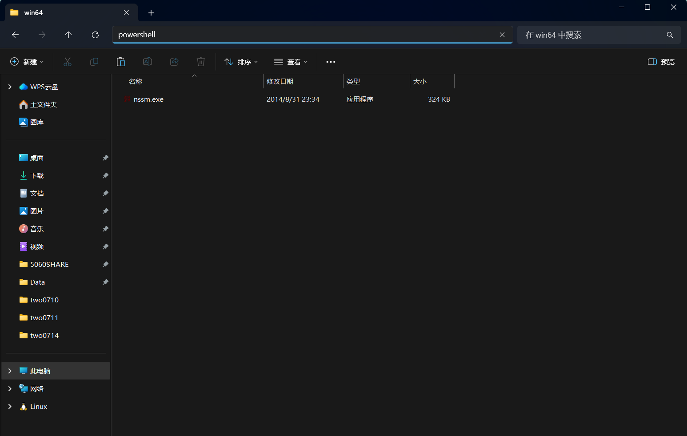
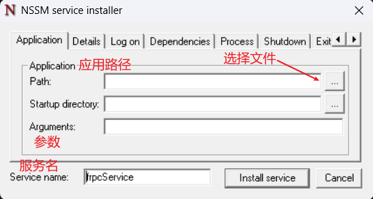
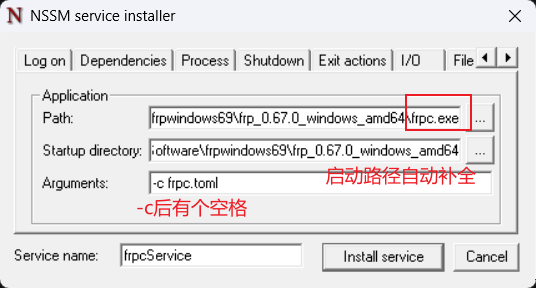

# 写在前面
我了解到FRP是因为我自己整了一个NAS，用这个NAS来同步公司电脑的文件到家里的NAS，这样在家里的电脑上访问公司文件就可以非常方便，在PDD总共花了不到1K。但是飞牛NAS官方免费提供的带宽只有3M，这个带宽对于同步一些文本文件还是足够的，当然飞牛官方也是可以购买更大的带宽的。我自己就喜欢DIY的，所以想怎么可以通过别的办法得到更大的带宽，然后在网上找了非常多的方法。了解到FRP这个内网穿透工具，将家里NAS的服务端口暴露到公网中去，需要一台有固定公网IP的服务器，刚好阿里云有针对学生的300元优惠券，我用这个优惠券买了一台服务器，这台服务器的系统我选择了Ubuntu24，带宽是共享200M，对我来说足够了。在服务器部署frps服务端，到飞牛NAS上部署一个frpc客户端，这样在公司的电脑上安装飞牛的官方同步软件可以将我指定的文件目录同步至我家的NAS中，在家里同一个局域网访问NAS中的文件非常快。当然这个FRP不仅仅用于NAS上，我自己使用到的场景还有远程控制，Windows自带的远程控制在局域网下非常好用，把这个远程控制的端口3389暴露到公网上我在家也可以远程控制公司的电脑了，延迟也不是很大，非常方便。
## 一、在服务器上安装frps服务端
### 1. 下载并安装 frps
```bash
sudo apt update
sudo apt install -y wget tar
```
#### 下载 [FRP](https://github.com/fatedier/frp)：
```bash
cd /tmp

wget https://github.com/fatedier/frp/releases/download/v0.70.0/frp_0.70.0_linux_amd64.tar.gz
```
#### 解压：
```bash
tar -xzf frp_0.70.0_linux_amd64.tar.gz
cd frp_0.70.0_linux_amd64
```
ARM64 服务器需要将下载文件名中的 linux_amd64 改成 linux_arm64。官方同时提供 AMD64 和 ARM64 的 Linux 安装包，此外也有windows_amd64版本的，可以在官方github仓库查看。
### 2. 创建配置目录
```bash
sudo mkdir -p /etc/frp
```
#### 创建配置文件：
```bash
sudo nano /etc/frp/frps.toml
```
#### 写入
```bash
# ============================================================
# FRP 服务端配置
# ============================================================

# frpc连接frps的端口
bindPort = 7000


# ============================================================
# Token认证
# ============================================================

# 使用Token认证
auth.method = "token"

# frpc客户端必须填写完全相同的Token，设置一个复杂点的
auth.token = "helloworld@1234"


# ============================================================
# Dashboard管理页面
# ============================================================

# 监听所有网络接口，允许通过公网IP访问
webServer.addr = "0.0.0.0"

# Dashboard访问端口
webServer.port = 7500

# Dashboard登录用户名
webServer.user = "frpadmin"

# Dashboard登录密码
# 请务必修改成复杂密码
webServer.password = "frpadmin@Pwd"
```
保存并退出。
```bash
Ctrl + O
Enter
Ctrl + X
```
### 3. 创建 systemd 服务
#### 创建服务文件：
```bash
sudo nano /etc/systemd/system/frps.service
```
#### 写入：
```INI
[Unit]
# 服务说明
Description=FRP Server

# 等待网络启动
After=network-online.target
Wants=network-online.target


[Service]
# 前台运行类型
Type=simple

# frps启动命令，修改为你自己的安装路径
ExecStart=/tmp/frp_0.70.0_linux_amd64/frps -c /etc/frp/frps.toml

# 异常退出后自动重启
Restart=on-failure

# 退出5秒后重启
RestartSec=5


[Install]
# 在多用户模式下启动
WantedBy=multi-user.target
```
官方推荐将 frps.service 放在 /etc/systemd/system/ 下，通过 ExecStart 指定程序和配置文件路径。  
保存并退出。
```bash
Ctrl + O
Enter
Ctrl + X
```
### 4. 启动并设置开机自启
#### 重新加载 systemd：
```bash
sudo systemctl daemon-reload
```
#### 启动服务并同时设置开机自启：
```bash
sudo systemctl enable --now frps
```
#### 查看运行状态：
```bash
sudo systemctl status frps
```
#### 正常应看到：
```bash
Active: active (running)
```
#### systemctl常用命令
```bash
# Start frp
sudo systemctl start frps
# Stop frp
sudo systemctl stop frps
# Restart frp
sudo systemctl restart frps
# Check frp status
sudo systemctl status frps
```
### 5. 开放防火墙和安全组
#### Ubuntu 使用 UFW 时：
```bash
sudo ufw allow 7000/tcp
```
#### 假设以后准备使用 3000～4999 作为映射端口：
```bash
sudo ufw allow 3000:4999/tcp
```
#### 启用防火墙前，先确保 SSH 已放行：
```bash
sudo ufw allow OpenSSH
sudo ufw enable
sudo ufw status
```
云服务器厂商的安全组也要放行：  
|端口|协议|用途|  
|-------:|:------|:--------|
|22|TCP|SSH登录|
|7000|TCP|frpc连接frps|
|7500|TCP|用于查看客户端在线情况|
|3000~4999|TCP|客户端映射端口|
## 二、客户端对应配置
#### Windows 或 Ubuntu 客户端的 frpc.toml 至少需要：
```TOML
# 云服务器公网IP
serverAddr = "你的云服务器公网IP"

# 对应服务端bindPort
serverPort = 7000

# 使用Token认证
auth.method = "token"

# 必须和服务端完全一致
auth.token = "helloworld@1234"


# 示例：映射本机3389端口，该端口为windows RDP的端口
[[proxies]]
name = "rdp"
type = "tcp"
localIP = "127.0.0.1"
localPort = 3389
remotePort = 3389
```
### 1. 下载frpc客户端在你需要暴露服务的电脑上
我这里想在家控制公司的电脑，于是我将frpc客户端安装在公司的电脑上。在[frp github](https://github.com/fatedier/frp/releases/tag/v0.70.0)下载windows版本的frp。如下图。

### 2. 设置排除项
下载完成后，在解压之前需要在windows安全中心将存放该frp客户端文件的目录设置为排除项，这样windows不会将该文件认为是病毒。  
设置方法：Windows安全中心->病毒和威胁防护->排除项->添加或删除排除项->添加排除项->文件夹。如下图所示。

### 3. 创建配置文件
对`frp_0.70.0_windows_amd64.zip`解压后，重要的是里面`frpc.exe`和`frpc.toml`，修改`frpc.toml`文件，该文件内容需要与服务器设置参数匹配。
```TOML
serverAddr = "你的服务器公网IP地址"
serverPort = 7000
# 你在服务端设置的token
auth.token = "helloworld@1234"

[[proxies]]
# 服务名可以自定义
name = "companyPcRDP"
type = "tcp"
localIP = "127.0.0.1"
localPort = 3389
remotePort = 3389
```
### 4. 启动frpc客户端
在`文件资源管理器`中，打开`frpc.exe`和`frpc.toml`所在的文件夹，在地址栏输入`powershell`进入终端，如图所示。
  
在终端中输入命令启动frpc客户端。
```bash
 .\frpc.exe -c .\frpc.toml
```
### 5. 将frpc启动设置为开机自启的服务
可以使用nssm这个工具将上面的命令设置为一个开机自启的服务，可以去[nssm官网下载](https://nssm.cc/download)，将该程序放在设置为排除项的那个文件夹中，解压后进入`win64`子目录，并在地址栏输入`powershell`并回车，如下图所示。
  
进入终端后，输入：
```bash
.\nssm.exe install frpcService
```
回车后，回弹出一个对话窗口，如图所示。

参数设置后如下图所示，参数设置完成后点击`Install service`。

回到`nssm.exe`所在的终端，输入下面命令启动该服务。
```bash
.\nssm.exe start frpcService
```
nssm常用命令如下：
```bash
To show service installation GUI:

        nssm install [<servicename>]

To show service removal GUI:

        nssm remove [<servicename>]
    
To manage a service:

        nssm start <servicename>

        nssm stop <servicename>

        nssm restart <servicename>

        nssm status <servicename>

        nssm rotate <servicename>
```
### 6. 查看连接到frps服务端的frpc
打开浏览器，在地址中输入http://你的服务器公网IP:7500，该用户名和密码是在`frps.toml`中设置的。